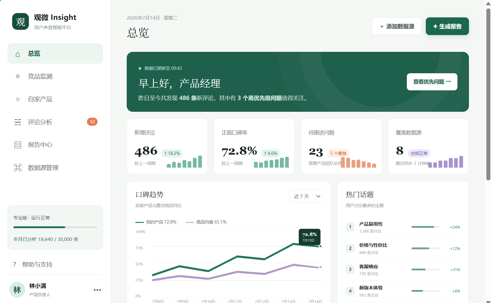
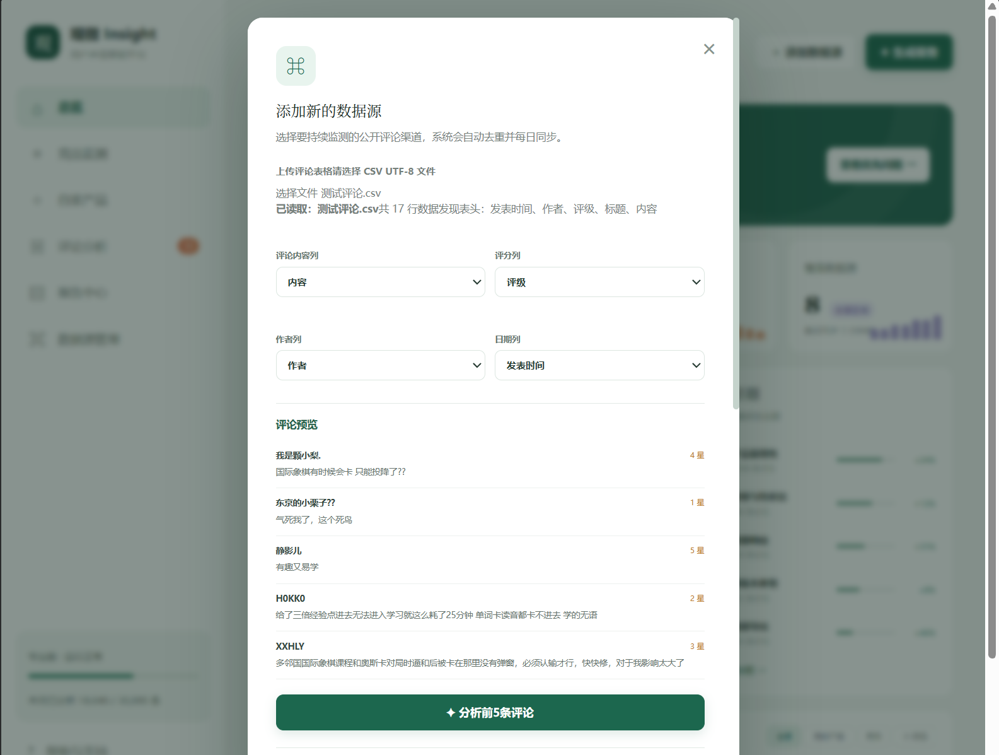
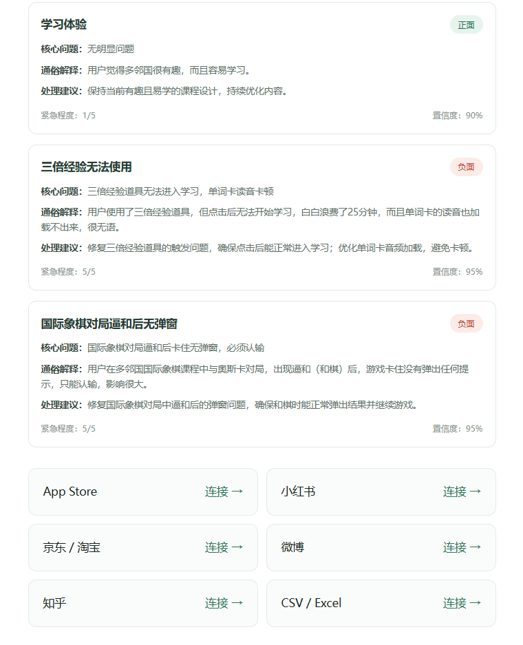

# 观微 Insight

面向产品团队的 AI 用户评论分析平台，将分散的用户评论转换为结构化的产品洞察和改进建议。

## 项目背景

产品团队每天需要处理大量来自应用商店、社交媒体和电商平台的用户反馈。传统的人工整理方式耗时较长，也容易遗漏高频问题和紧急故障。

观微 Insight 希望通过 CSV 数据导入和大模型分析，帮助产品经理快速回答：

- 用户当前最不满意的问题是什么？
- 哪些问题最紧急、应该优先处理？
- 用户反馈主要集中在哪些产品模块？
- 正面评价中体现了哪些产品优势？
- 下一版本可以采取哪些具体改进措施？

## 核心功能

### 1. 评论数据导入

- 支持上传 UTF-8 编码的 CSV 文件
- 自动读取表头和评论数据
- 自动识别评论、评分、作者、标题和日期字段
- 支持用户手动修正字段映射
- 分析前预览真实评论内容

### 2. AI 评论分析

通过服务端接口调用 DeepSeek 大模型，对评论进行结构化分析：

- 情感判断：正面、负面或中性
- 主题归类：识别评论涉及的产品模块
- 核心问题：提取用户真正遇到的问题
- 紧急程度：辅助判断问题处理优先级
- 改进建议：生成面向产品团队的处理建议
- 通俗解释：解释评论中的行业术语或专业表达
- 置信度：展示模型对分析结果的判断信心

### 3. 产品化交互

- CSV 表头自动识别与手动确认
- 评论内容预览
- AI 分析加载状态
- 结构化分析结果卡片
- 异常提示与 API Key 安全隔离
- 适配长内容的弹窗滚动体验

## 产品流程

```text
上传 CSV
   ↓
自动识别表头
   ↓
用户确认字段
   ↓
预览评论内容
   ↓
发送至服务端 API
   ↓
调用 DeepSeek 大模型
   ↓
返回结构化分析结果
   ↓
辅助产品决策
```

## 技术方案

| 模块 | 技术 | 作用 |
|---|---|---|
| 前端页面 | React、Next.js、TypeScript | 构建产品界面和交互 |
| CSV 解析 | Papa Parse | 在浏览器中读取评论表格 |
| AI 接口 | DeepSeek API | 完成评论理解和结构化分析 |
| 服务端接口 | Next.js Route Handler | 隔离 API Key 并转发分析请求 |
| 页面样式 | CSS | 构建响应式产品界面 |
| 版本管理 | Git、GitHub | 保存版本并展示项目成果 |

## 为什么这样设计

### 为什么使用 CSV 作为第一版数据入口？

CSV 格式常见、容易获得，也方便验证评论分析流程。第一版先解决“评论能否被正确读取和分析”的核心问题，再逐步接入经过授权的平台 API。

### 为什么自动识别表头后还需要人工确认？

不同平台导出的字段名称不统一。完全自动识别可能出错，因此采用“系统推荐 + 用户确认”的方式，在效率和准确性之间取得平衡。

### 为什么通过服务端调用大模型？

API Key 不能写在浏览器代码中。服务端接口能够隐藏密钥，并为后续加入身份验证、调用限制、成本控制和错误重试留下空间。

## 本地运行

### 1. 环境要求

- Node.js 22.13.0 或更高版本
- npm
- DeepSeek API Key

### 2. 安装依赖

```bash
npm install
```

### 3. 配置环境变量

在项目根目录创建 `.env.local`：

```env
DEEPSEEK_API_KEY=your_api_key_here
DEEPSEEK_MODEL=deepseek-chat
```

请不要把真实 API Key 上传到 GitHub。

### 4. 启动项目

```bash
npx --no-install vinext dev
```

启动后访问：

```text
http://localhost:3000
```

## 当前版本

当前版本已经完成：

- CSV 文件上传
- 表头自动识别
- 字段手动确认
- 评论内容预览
- DeepSeek API 服务端接入
- 前五条评论结构化分析
- AI 分析结果展示
- 专业术语通俗解释
- API Key 环境变量保护

## 当前限制

- 当前仅分析前五条评论，用于控制测试成本
- 刷新页面后数据不会永久保存
- 首页部分指标仍为演示数据
- 尚未实现用户登录和多用户数据隔离
- 尚未接入自动定时采集
- 尚未生成可下载的日报和周报

这些限制将作为后续版本的迭代方向，而不是将尚未完成的功能描述为已完成。

## 后续规划

- [ ] 将真实分析结果接入“评论分析”页面
- [ ] 使用真实数据计算首页指标
- [ ] 增加数据库与历史任务记录
- [ ] 支持批量分析、进度显示和失败重试
- [ ] 增加重复评论识别和成本控制
- [ ] 自动生成日报与周报
- [ ] 接入经过授权的公开数据 API
- [ ] 增加账号、权限和多租户能力
- [ ] 完善日志、监控与数据合规机制

## 项目定位

观微 Insight 当前是一个可运行的 AI 产品 MVP，重点验证以下产品假设：

> 大模型能否帮助产品团队更快地把非结构化用户评论，转化为可执行的产品改进建议？

本项目持续迭代中。

## 产品展示

### 产品总览



> 说明：总览页中的指标为界面演示数据，真实数据接入仍在迭代中。

### CSV 智能导入与字段识别



> 示例数据来自公开评论，仅用于产品功能演示。

### AI 评论分析结果



> 当前版本分析前五条评论；短文本和语义不完整评论可能出现误判。
